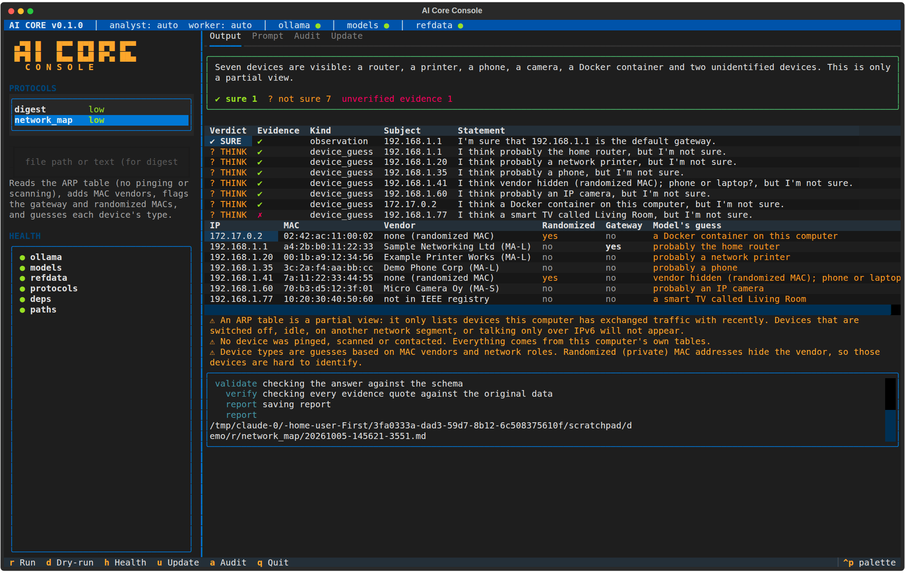

# AI Core Console

A small Python framework that runs preset **protocols** against a local LLM
(through Ollama on `localhost:11434`) and shows the results in a full-screen
text dashboard.

## The core rule: code collects, the model interprets

- **Collectors** are plain Python. They read a file or run one fixed,
  read-only, allow-listed command.
- **The model gets no tools, no shell and no network.** It only receives the
  collected text and must answer in JSON.
- All collected data is treated as **untrusted**. Every answer is checked
  against a JSON schema before it is used.
- **Code checks the evidence.** Every finding must quote the evidence it is
  based on. The framework searches for those quotes in the collected data and
  labels each finding:
  - **✔ SURE**: "I'm sure that X". The finding is observed and all its evidence was found.
  - **? THINK**: "I think X, but I'm not sure". The finding is inferred, or its evidence could not be found.
- Network use: Ollama on localhost only. The one exception is the **Update**
  section, which downloads reference data (such as the IEEE MAC vendor
  registry) from a fixed list of URLs, and only when you ask it to. A test
  checks that only these two files in the framework can use the network.
- It isn't tied to any one model. Protocols ask for *roles* (`analyst`,
  `worker`), and `config/console.toml` decides which model fills each role.

## The dashboard

```bash
aicore console
```



*(Screenshot from a test run with sample data and a fake model. The made-up
"smart TV called Living Room" was caught: its evidence isn't in the data.)*

| Key | Does |
|---|---|
| `r` / `d` | run / dry-run the selected protocol (digest: type a file path or paste text first) |
| `h` | re-run the health checks (left pane, and dots in the status bar) |
| `u` | Update tab: reference data ages; downloads only when you press a button |
| `a` | Audit tab: recent runs, with a sparkline of run times |
| `q` | quit |

The boot animation and banner can be switched off in `config/console.toml` (`[ui]`).

## First run on your machine (step 14)

```bash
pip install -e ".[dev]"
pytest                          # everything should pass, no Ollama needed
ollama serve                    # in another terminal, if it isn't running
ollama pull llama3.1:8b         # or any chat model you like
ollama pull llama3.2:3b         # optional small "worker" for big inputs
aicore health                   # fix anything red (it tells you how)
aicore update --all             # fetch the IEEE vendor registries
aicore dry-run network_map      # see exactly what the model will get
aicore run network_map
aicore run digest --file tests/fixtures/digest/app.log
aicore console
```

## Prompt injection

Collected data may contain text written to fool the model ("ignore previous
instructions", a fake `SYSTEM:` line, a forged answer, a fake end-of-data
marker). The defences don't rely on the model resisting:

- the model has no tools, and its answer may only contain the fields the
  schema names (no `run_command`, no self-awarded verdicts)
- data is fenced with a random marker the data can't predict
- `core/injection.py` flags suspicious lines; protocols report them, and a
  quote that appears **only** inside such a line is not accepted as
  evidence, so planted "findings" can't come out as ✔ SURE
- big inputs: worker notes are checked before the analyst sees them, and
  worker summaries are never evidence

`tests/test_injection.py` runs a catalogue of these tricks against a
deliberately gullible fake model.

## Status

Built in steps, with a review after each one.

| Step | What | State |
|---|---|---|
| 1 | Project skeleton, config, test setup | ✅ |
| 2 | Protocol manifests + discovery + `aicore list` | ✅ |
| 3 | Schema validation + evidence verification (SURE / THINK) | ✅ |
| 4 | Model backend (Ollama, localhost only) + role resolver | ✅ |
| 5 | Pipeline, audit log, reports, `run` / `dry-run` | ✅ |
| 6 | Digest protocol | ✅ |
| 7 | Chunking (worker model → analyst model) | ✅ |
| 8 | Local reference database (SQLite) | ✅ |
| 9 | Passive network map protocol | ✅ |
| 10 | Health checks | ✅ |
| 11 | Update section (reference data downloads) | ✅ |
| 12 | Prompt-injection test suite | ✅ |
| 13 | Full-screen dashboard (Textual) | ✅ |
| 14 | Tuning against your real Ollama | ⏳ (needs you) |

## Setup

```bash
python3 -m venv .venv
source .venv/bin/activate          # Windows: .venv\Scripts\activate
pip install -e ".[dev]"
pytest                             # runs all tests; no Ollama needed
aicore version
aicore list                        # protocols found in protocols/
aicore models                      # installed models + which one plays each role
aicore health                      # is everything ready? (green / amber / red)
aicore dry-run <protocol> --file x # show exactly what would be sent; sends nothing
aicore run <protocol> --file x     # run it; report saved to reports/<protocol>/
```

Every run (including dry-runs, refusals and failures) adds one line to
`logs/audit.jsonl`. The log stores fingerprints (SHA-256) of your data and
the model's answer, never the data itself.

## Protocols

| Protocol | What it does |
|---|---|
| `network_map` | Passive network map. Reads the ARP table and default gateway (Linux: `/proc/net/arp`, `/proc/net/route`; Windows: `arp -a`, `route print -4`). Never pings, scans or contacts anything. Drops broadcast/multicast/incomplete entries, adds MAC vendors from the local IEEE database, flags randomized MACs, the gateway, and one-MAC-many-IPs / one-IP-many-MACs patterns; the model guesses each device's type. Every report states that an ARP table is a partial view. |
| `digest` | Summarises a file or pasted text (CSV, JSON, JSON Lines, logs, plain text). Code computes the facts (rows, outliers, missing keys, time gaps, repeated lines, instruction-like text); the model interprets them as observations, anomalies and hypotheses. |

```bash
aicore run network_map
aicore run digest --file tests/fixtures/digest/app.log
cat some.log | aicore run digest --file -
```

## Reference data (MAC vendors)

The network map looks up MAC vendors in a local SQLite database
(`data/reference.db`), built from the IEEE registries.

**Update section** (`aicore update`, or the Update tab in the dashboard):
shows each registry's age and downloads fresh copies **only when you ask**,
and only from the hosts listed in `core/updater/sources.toml` (https,
standards-oui.ieee.org). Every download is checked like an import, and a
failed or bad download keeps the old data. Each attempt is in the audit log.

```bash
aicore update              # what's there and how old it is
aicore update --all        # download all five registries
aicore update MA-L MA-S    # just these
```

No internet on this machine? Download the files elsewhere and import them:

| Registry | File |
|---|---|
| MA-L (large blocks, the classic "OUI") | https://standards-oui.ieee.org/oui/oui.csv |
| MA-M (medium blocks) | https://standards-oui.ieee.org/oui28/mam.csv |
| MA-S (small blocks) | https://standards-oui.ieee.org/oui36/oui36.csv |
| IAB (older small blocks) | https://standards-oui.ieee.org/iab/iab.csv |
| CID (company IDs) | https://standards-oui.ieee.org/cid/cid.csv |

```bash
aicore refdata import oui.csv mam.csv oui36.csv iab.csv cid.csv
aicore refdata status                  # entries per registry, age, source
aicore refdata lookup a4:2b:b0:11:22:33
```

Files are checked before anything changes: wrong columns or more than 1%
bad rows means the import is refused and the old data stays. A good file
replaces its registry completely, and the database is swapped in in one
step, so it is never left half-written.

## Adding a protocol

Copy `protocols/_template/`, rename the folder, and edit `manifest.toml`
(every option is explained in comments). It is picked up automatically.
If something is wrong, `aicore list` tells you exactly what.

## Layout

```
config/console.toml   your settings (roles → models, paths, UI options)
core/                 the framework
protocols/            one folder per protocol (auto-discovered)
data/                 local reference database (created by the importer/updater)
tests/                tests using fake data, no Ollama, no network
```
